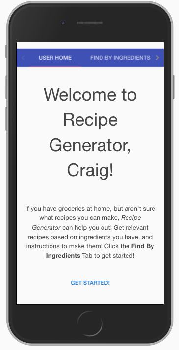
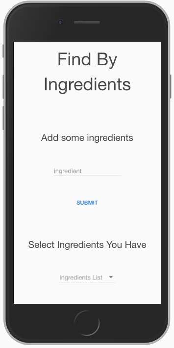
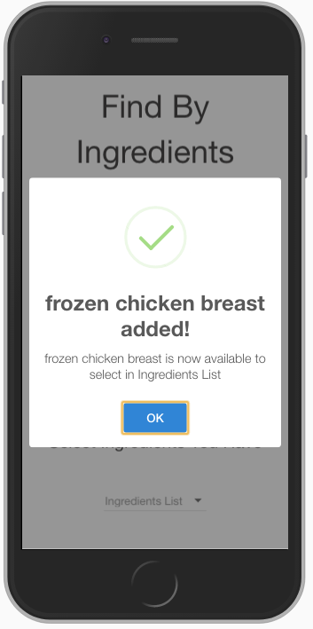
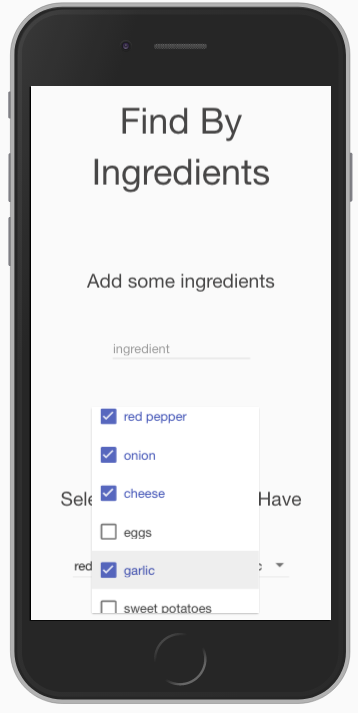
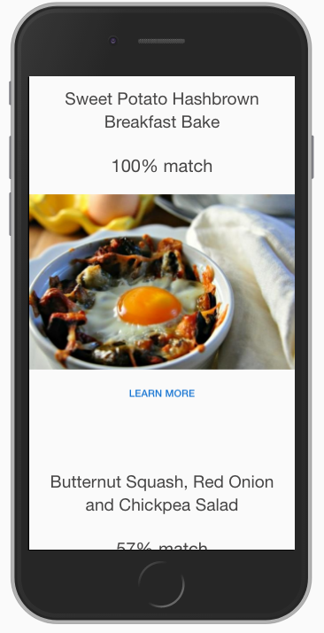
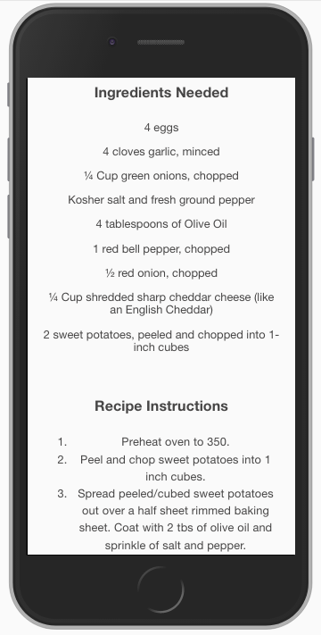

# Recipe Generator

## Description
Recipe Generator was created to solve a frequent personal problem, which was that when I wanted to plan meals, I often did not know what recipes that could be made based off of the ingredients I had on hand. Recipe Generator solves this problem by allowing users to create an account and enter ingredients that they have. These ingredients are then sent to an API called Spoonacular that returns recipes including the ingredients entered, and provides images, summaries, ingredients needed, and recipe instructions for each. I had 2 weeks to complete this application. Next steps for this project would be to build out another feature that allows recipes to be saved and ranked.

## Product Example

### Login Page
The login page allows a user to login to their account, or if they don't have an account, they can register.

### Welcome Page
The welcome page gives a short intro to the application and tells the user what to do to get started.

### Find By Ingredients Page
The find by ingredients page allows users to add the ingredients they have available at home to their "list".

### Adding Ingredients
Once a user has added an ingredient, they receive a confirmation and the ingredient is available to select from their "list" below.

### Selecting Ingredients
Once the user has added the ingredients they have available, they can select the ones they want to use to search for recipes with.

### Recipe Results Page
The recipe results page displays several different recipes that the user can make based of of the ingredients they selected. The user can also how closely their ingredients match with each recipe.

### Recipe Details Page
When a user clicks on any recipe, from the recipe results page, they are directed to the recipe details page, which gives them a summary of the selected recipe, the ingredients that are needed, and step by step instructions to make it.

## Getting Started
The application is hosted at - [vast-scrubland-37077.herokuapp.com](https://vast-scrubland-37077.herokuapp.com),
or these instructions will get you a copy of the project up and running on your local machine for development and testing purposes.

1. Download .zip file
2. npm install
3. npm start
4. localhost:5000 in browser

## Technologies Used
- JavaScript
- Angular
- Node
- Express
- MongoDB
- M-Lab
- Angular Material
- HTML
- CSS
- Sweet Alert 2
- Grunt
- Heroku
